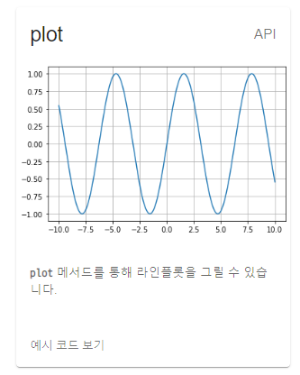
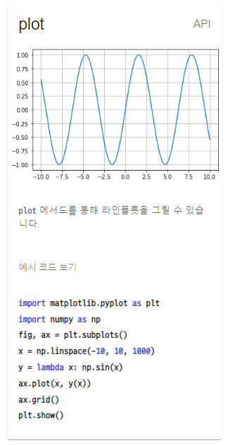
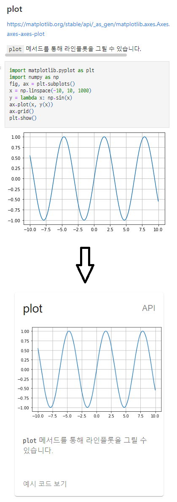

# 사용방법

## 1. `public/src.ipynb` 파일 수정하기

- 치트시트는 철저히 `public/src.ipynb`에 기반하여 빌드됩니다.
- 아주 엄격하게 규칙들을 지켜야지만 에러 없이 잘 빌드된다는 점 기억해주시기 바랍니다.
- 룰은 다음과 같습니다.

## 2. 마크다운 셀 작성하기

```markdown
### plot
https://matplotlib.org/stable/api/_as_gen/matplotlib.axes.Axes.plot.html#matplotlib-axes-axes-plot

`plot` 메서드를 통해 라인플롯을 그릴 수  있습니다.
```

- 먼저 반드시 마크다운셀과 코드셀은 서로 번갈아가면서 등장해야 합니다.
- 마크다운셀의 경우, 첫째줄에는 "반드시" 제목을, 바로 다음 줄에 "반드시" 관련 링크(e.g. 공식문서)를 첨부해야 합니다.
- 그리고 한 줄 뛰운 다음 설명을 작성합니다.



- 위에 등장하는 표 이미지는 코드셀의 실행 결과(`matplotlib`)입니다.

## 3. 코드셀 작성하기

```python
import matplotlib.pyplot as plt
import numpy as np
fig, ax = plt.subplots()
x = np.linspace(-10, 10, 1000)
y = lambda x: np.sin(x)
ax.plot(x, y(x))
ax.grid()
plt.show()
```

- 마크다운셀 작성을 완료했다면 코드셀을 작성할 차례입니다.
- 위와 같이 코드셀을 작성했을 경우 다음과 같이 빌드됩니다.



- 정리하면 Ipython Notebook 파일은 아래와 같이 치트시트로 변환됩니다.



## 4. `src/config.js` 작성하기

```js
const BASE_URL = "https://howsmyanimeprofilepicture.github.io/matplotlib-cheat-sheet";
const columnsCountBreakPoints = { 
    "340": 1, 
    "680": 2, 
    "1020": 3,
    "1360": 4,
    "1700": 5,
};
const maxWidth = 320;


export {
    BASE_URL, columnsCountBreakPoints, maxWidth
}
```

- 그 다음으로는 `src/config.js` 파일을 설정해야 합니다.
- `BASE_URL`과 스크린 크기에 따른 컴포넌트 너비를 설정할 수 있습니다.

## 5. 빌드 시작하기

```bash
sh ./build.sh
```

- `build.sh` 스크립트를 실행시킴으로써 빌드를 수행합니다.
