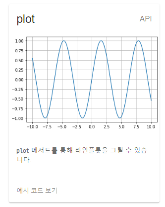
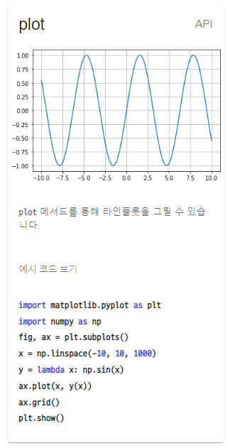
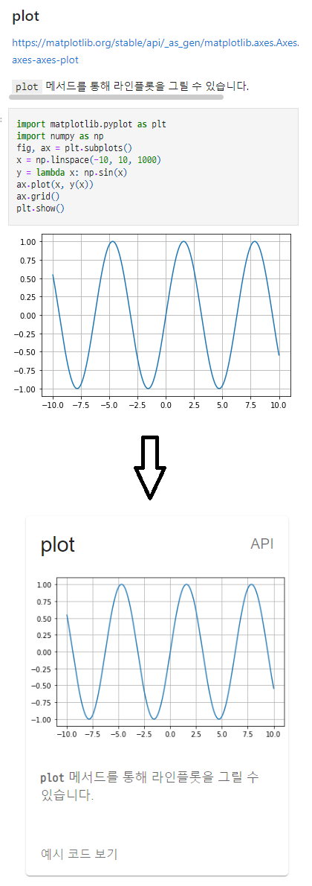

# 컴포넌트 단계부터 개발하고자 하는 분들을 위한

* ["한장으로 살펴보는 pandas"](https://pseudo-lab.github.io/cheat-sheet/?src=pandas)
* ["한장으로 살펴보는 matplotlib"](https://pseudo-lab.github.io/cheat-sheet/?src=matplotlib)

## 1. `public/src.ipynb` 파일 수정하기

* 치트시트는 철저히 `docs/assets/*.ipynb`에 기반하여 빌드됩니다.
* 아주 "엄격하게!" 규칙들을 지켜야지만 에러 없이 잘 빌드된다는 점 기억해주시기 바랍니다.
* 룰은 다음과 같습니다.

## 2. 마크다운 셀 작성하기

```markdown
### plot
https://matplotlib.org/stable/api/_as_gen/matplotlib.axes.Axes.plot.html#matplotlib-axes-axes-plot

`plot` 메서드를 통해 라인플롯을 그릴 수  있습니다.
```

* 먼저 반드시 마크다운셀과 코드셀은 서로 번갈아가면서 등장해야 합니다.
* 마크다운셀의 경우, 첫째줄에는 "반드시" 제목을, 바로 다음 줄에 "반드시" 관련 링크(e.g. 공식문서)를 첨부해야 합니다.
* 그리고 한 줄 뛰운 다음 설명을 작성합니다.



* 위에 등장하는 표 이미지는 코드셀의 실행 결과(`matplotlib`)입니다.

## 3. 코드셀 작성하기

```python
import matplotlib.pyplot as plt
import numpy as np
fig, ax = plt.subplots()
x = np.linspace(-10, 10, 1000)
y = lambda x: np.sin(x)
ax.plot(x, y(x))
ax.grid()
plt.show()
```

* 마크다운셀 작성을 완료했다면 코드셀을 작성할 차례입니다.
* 위와 같이 코드셀을 작성했을 경우 다음과 같이 빌드됩니다.



* 정리하면 Ipython Notebook 파일은 아래와 같이 치트시트로 변환됩니다.



## 4. `src/config.json` 와 `package.json` 작성하기

`src/config.json`

```json
// src/config.json
{
    "BASE_URL": "https://pseudo-lab.github.io",
    "BASE_NAME": "/cheat-sheet",
    "columnsCountBreakPoints": {
        "340": 1,
        "680": 2,
        "1020": 3,
        "1360": 4,
        "1700": 5
    },
    "maxWidth": 320
}
```

그 다음으로는 `src/config.jsson`의 경우에는 위와 같이 설정할 수 있습니다.

* `BASE_URL`은 우리가 사용할 깃허브 페이지 URL의 host에 해당하는 부분입니다.
* `BASE_NAME`은 repo name을 적어줍니다. __슬래시(`/`)위치까지 반드시 엄격하게__ 지켜주셔야지 에러 없이 빌드된다는 점 꼭 유의해주시기 바랍니다.
* `columnsCountBreakPoints`은 클라이언트의 화면 크기에 따라 몇개의 컬럼을 보여줄 것인지에 관한 옵션입니다.
* `maxWidth`는 각 컬럼의 최대 너비입니다.

`package.json`

```json
// package.json
{
...
    "homepage": "https://pseudo-lab.github.io/cheat-sheet",
    ...
    "scripts":{
        ...
        "start": "parcel --dist-dir docs",
        "build": "parcel build --dist-dir docs --public-url https://pseudo-lab.github.io/cheat-sheet",
        "predeploy": "npm run build",
        "deploy": "gh-pages -d docs"
        ...
    }
...
}
```

`package.json`에서 딱 한가지만 꼭 지켜주셔야 할 룰을 말씀드리자면, `homepage` 프로퍼티 그리고 `script.build`프로퍼티의 `--public-url` 플래그에 반드시 최종적인 웹 페이지가 빌드될 URL을 명시해야주셔야 한다는 것입니다. 슬래시(`/`) 위치까지 되도록 지켜주시기 바랍니다.

## 5. 개발 서버 실행하기

```bash
npm start
```

이 어플리케이션은 [parcel](https://parceljs.org/)이라는 번들러를 기반으로 제작되었습니다. 간단하게 `npm start`라는 명령어를 터미널에서 실행하면 `1234`번 포트로 개발용서버가 실행됩니다.

`package.json`

```json
// package.json
{
    ...
    "scripts":{
        ...
        "start": "parcel --dist-dir docs",
        "build": "parcel build --dist-dir docs --public-url https://pseudo-lab.github.io/cheat-sheet",

        ...
    }
    ...
}    
```

물론 `package.json` 파일에서 원하는 형태로 개발 옵션을 설정하는 것도 가능합니다.

## 6. 배포하기

```bash
# 아래의 명령어를 입력하면 자동으로
# 원격으로 연결된 repository의 gh-pages브랜치에
# 배포되어야 하는 파일들(우리의 경우에는 docs 디렉토리)이 push됩니다.
npm run deploy
```

* 배포는 gh-pages라는 라이브러리를 활용하게 됩니다.
* 개발 branch와 github page로 배포되는 branch를 완벽하게 분리할 수 있게 해주는 아주 고맙고 사랑스러운 라이브러리입니다.
* `package.json`에는 이미 배포를 위한 명령어들이 정의 되어 있습니다. 상황에 맞춰 수정해주셔도 무방합니다.

`package.json`

```json
{
    ...
    "predeploy": "npm run build",
    "deploy": "gh-pages -d docs"
    ...
}    
```
